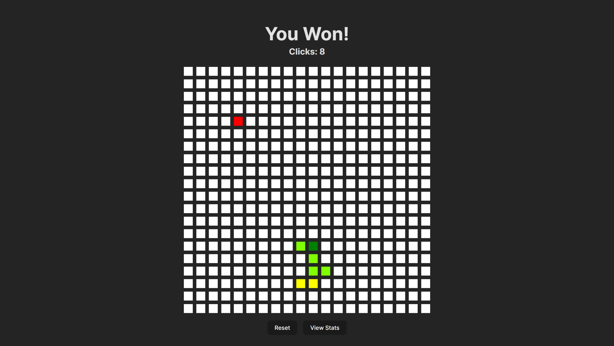
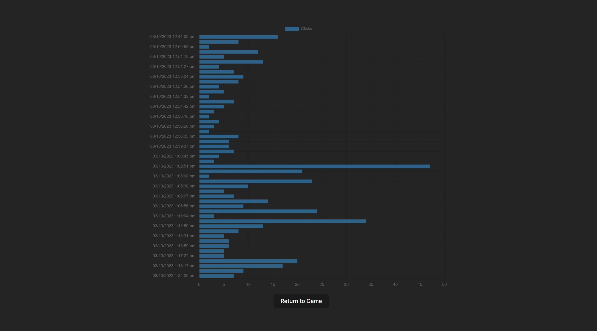

# Tile Guessing Game Game (hot or cold)

This is just a fun little game where users can try and guess the tile in a 20x20 grid. They're also able to manage
their stats.

This was just a little lunch-time project inspired by someones elses project I saw. Still uses the default Vite styling.




## Setting up the project

### Prerequisites

- [Npm](https://www.npmjs.com/get-npm)

### Installation

1. Install NPM packages
   ```sh
   npm install

2. Run the project
   ```sh
   npm run dev

## Playing the Game

### How to play

1. Click on a tile in the grid
2. Depending on how far you are, the tile will be red (far away), yellow (getting closer), or chartreuse (very close) or
   or green (you got it!)
3. Keep guessing until you get it right!
4. You can also manage your stats by clicking on the "Stats" button after the game ends